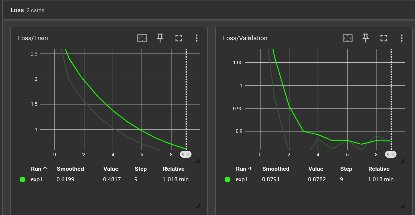
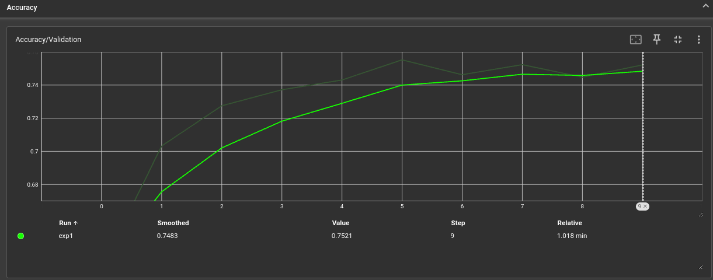
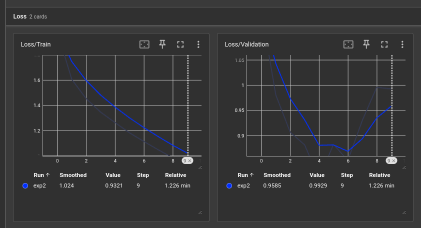
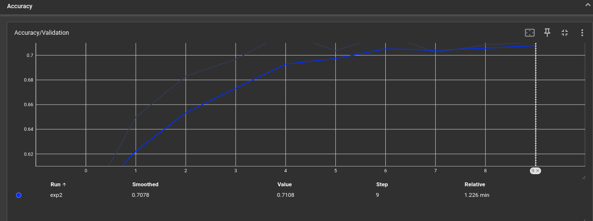
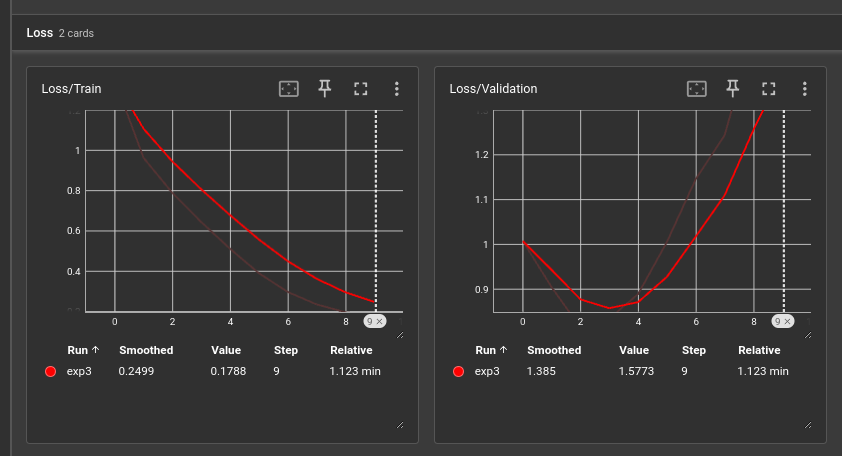
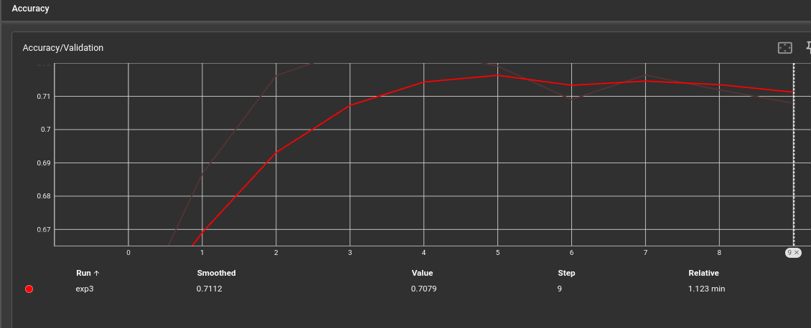

# ai_hub_itmo_image_hw4
# ФИО: Суслов Михаил Анатольевич

# Предмет: Обработка и генерация изображений

Лабораторная работа №4

# Задача: Разные виды дистилляции

# Датасет: CIFAR10

# Pre-exp:
Accuracy teacher model: 0.77

Accuracy student model: 0.7

# Эксперимент 1:
Loss:

Accuracy:

Best val accuracy student: 0.7552

# Эксперимент 2:
Loss:

Accuracy:

Best val accuracy student: 0.7183

# Эксперимент 3:
Loss:

Accuracy:

Best val accuracy student: 0.7239

