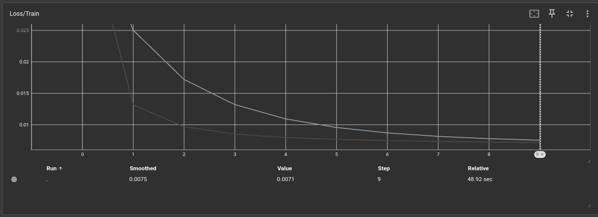
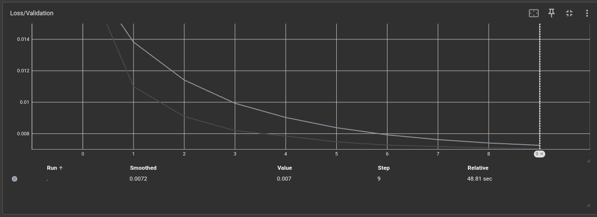
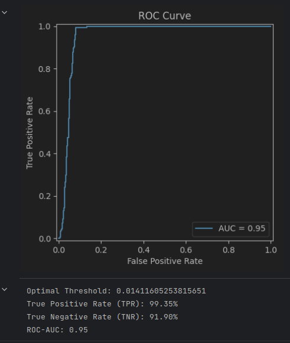
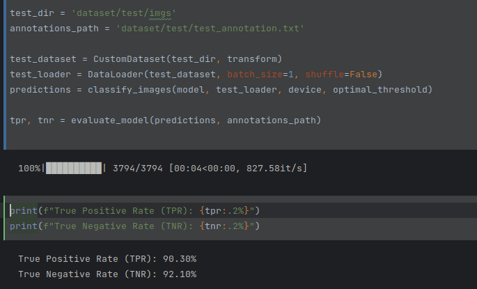

# ai_hub_itmo_image_hw2
# ФИО: Суслов Михаил Анатольевич

# Предмет: Обработка и генерация изображений

Лабораторная работа №2

# Задача: Детекция аномалий

# Датасет: Предоставленный в самой лаб. работе

# Результаты обучения:
Loss train:

Loss val:

# Результаты третьего пункта

# Результаты работы модели на тесте

