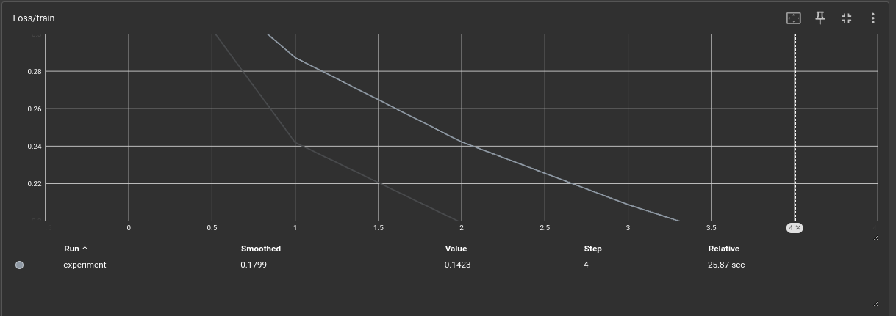
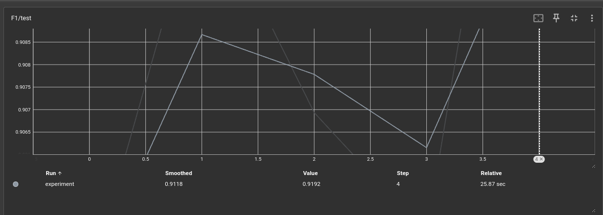
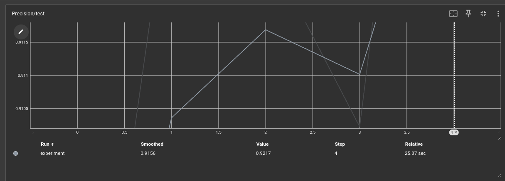
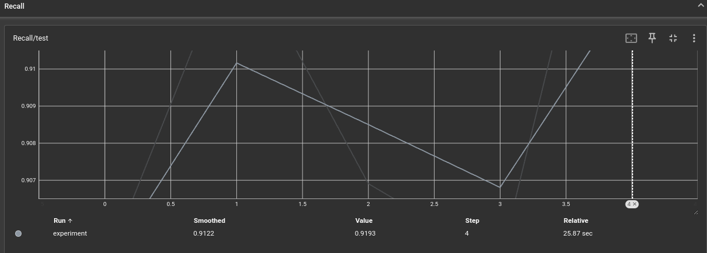
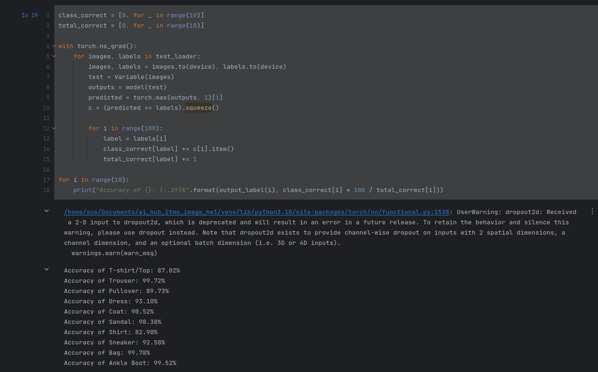
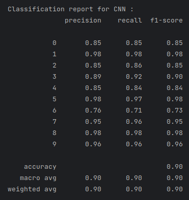

# ai_hub_itmo_image_hw1
# ФИО: Суслов Михаил Анатольевич

# Предмет: Обработка и генерация изображений

Лабораторная работа №1

# Задача: Многоклассовая классификация

# Датасет: FashionMnist

# Результаты обучения:

Loss:

Metrics:
F1:

Precision:

Recall:

Вместо примеров работы скриншот точности по каждому классу на тесте:

# Значения метрик:

